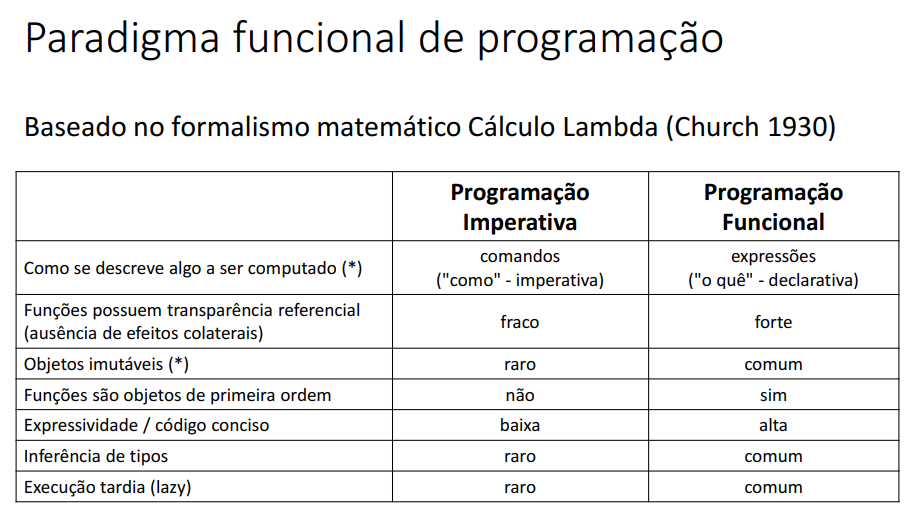
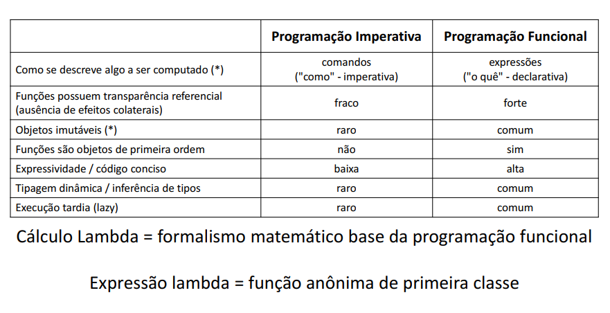
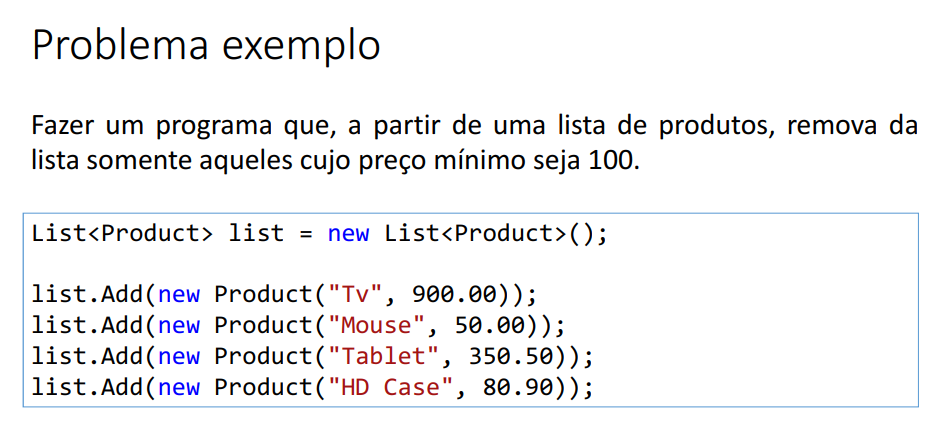

# Lambda, Delegates e LINQ

## Uma experiência com Comparison<T>

### Problema
- Suponha uma classe Product com os atributos name e price.
  
- Suponha que precisamos ordenar uma lista de objetos Product.

- Podemos implementar a comparação de produtos por meio daimplementação da interface IComparable<Product>

- Entretanto, desta forma nossa classe Product não fica fechada para alteração: se o critério de comparação mudar, precisaremos alterar a classe Product.

- Podemos então usar outra sobrecarga do método "Sort" da classe List:
  - `public void Sort(Comparison<T> comparison)`

<br>

### Comparison<T> (System)

https://msdn.microsoft.com/en-us/library/tfakywbh(v=vs.110).aspx

```c#
public delegate int Comparison<in T>(T x, T y);

```

Método Sort com Comparison<T> da classe List:
https://msdn.microsoft.com/en-us/library/w56d4y5z%28v=vs.110%29.aspx

<br>

## Programação funcional e cálculo lambda



<br>

## Transparência referencial

Uma função possui transparência referencial se seu resultado for sempre o mesmo para os mesmos dados de entrada. Benefícios: simplicidade e previsibilidade.

> Exemplo de função que não é referencialmente transparente:
```c#
using System;

namespace Course
{
  class Program
  {
    public static int globalValue = 3;

    static void Main(string[] args)
    {
      int[] vect = new int[] { 3, 4, 5 };
      ChangeOddValues(vect);
      Console.WriteLine(string.Join(" ", vect));
    }

    public static void ChangeOddValues(int[] numbers)
    {
      for (int i = 0; i < numbers.Length; i++)
      {
        if (numbers[i] % 2 != 0) {
          numbers[i] += globalValue;
        }
      }
    }
  }
}
```

<br>

### Funções são objetos de primeira ordem (ou primeira classe)

Isso significa que funções podem, por exemplo, serem passadas como parâmetros de
métodos, bem como retornadas como resultado de métodos.

```c#
class Program
{
  static int CompareProducts(Product p1, Product p2)
  {
    return p1.Name.ToUpper().CompareTo(p2.Name.ToUpper());
  }

  static void Main(string[] args)
  {
    List<Product> list = new List<Product>();

    list.Add(new Product("TV", 900.00));
    list.Add(new Product("Notebook", 1200.00));
    list.Add(new Product("Tablet", 450.00));
    list.Sort(CompareProducts);
    
    (...)
```

<br>

### Inferência de tipos

```c#
List<Product> list = new List<Product>();

list.Add(new Product("TV", 900.00));
list.Add(new Product("Notebook", 1200.00));
list.Add(new Product("Tablet", 450.00));

list.Sort((p1, p2) => p1.Name.ToUpper().CompareTo(p2.Name.ToUpper()));

foreach (Product p in list)
{
  Console.WriteLine(p);
}
```

<br>

### Expressividade / "como" vs. "o quê"
```c#
int sum = 0;
foreach (int x in list)
{
  sum += x;
}
```
#### vs.
```c#
int sum = list.Aggregate(0, (x, y) => x + y);
```

<br>

### Expressões lambda
Em programação funcional, expressão lambda corresponde a uma
função anônima de primeira classe.

```c#
class Program
{
  static int CompareProducts(Product p1, Product p2)
  {
    return p1.Name.ToUpper().CompareTo(p2.Name.ToUpper());
  }
  
  static void Main(string[] args)
  {
    (...)

    list.Sort(CompareProducts);
    
    list.Sort((p1, p2) => p1.Name.ToUpper().CompareTo(p2.Name.ToUpper()));
    
    (...)
```



<br>

## Introdução a delegates

### Delegates
https://docs.microsoft.com/en-us/dotnet/standard/delegates-lambdas

- É uma referência (com type safety) para um ou mais métodos
  - É um tipo referência

- Usos comuns:
  - Comunicação entre objetos de forma flexível e extensível (eventos / callbacks)
  - Parametrização de operações por métodos (programação funcional)

### Delegates pré-definidos
- Action
- Func
- Predicate

### Demo 1
```c#
namespace Course.Services
{
  class CalculationService
  {
    public static double Max(double x, double y)
    {
      return (x > y) ? x : y;
    }

    public static double Sum(double x, double y)
    {
      return x + y;
    }

    public static double Square(double x)
    {
      return x * x;
    }
  }
}
```

### Demo 2
```c#
using System;
using Course.Services;

namespace Course
{
  delegate double BinaryNumericOperation(double n1, double n2);
  
  class Program
  {
    static void Main(string[] args)
    {
      double a = 10;
      double b = 12;
      
      // BinaryNumericOperation op = CalculationService.Sum;
      BinaryNumericOperation op = new BinaryNumericOperation(CalculationService.Sum);
      
      // double result = op(a, b);
      double result = op.Invoke(a, b);
      Console.WriteLine(result);
    }
  }
}
```

<br>

## Multicast delegates
- Delegates que guardam a referência para mais de um método
- Para adicionar uma referência, pode-se usar o operador +=
- A chamada Invoke (ou sintaxe reduzida) executa todos os métodos na
ordem em que foram adicionados
- Seu uso faz sentido para métodos void

### Demo 1
```c#
using System;

namespace Course.Services
{
  class CalculationService
  {
    public static void ShowMax(double x, double y)
    {
      double max = (x > y) ? x : y;
      Console.WriteLine(max);
    }

    public static void ShowSum(double x, double y)
    {
    double sum = x + y;
    Console.WriteLine(sum);
    }
  }
}
```

### Demo 2
```c#
using System;
using Course.Services;

namespace Course
{
  delegate void BinaryNumericOperation(double n1, double n2);
  
  class Program
  {
    static void Main(string[] args)
    {
      double a = 10;
      double b = 12;
      
      BinaryNumericOperation op = CalculationService.ShowSum;
      op += CalculationService.ShowMax;
      op(a, b);
    }
  }
}
```

<br>

## Predicate (System)
Representa um método que recebe um objeto do tipo T e retorna um valor booleano

https://msdn.microsoft.com/en-us/library/bfcke1bz%28v=vs.110%29.aspx


```c#
public delegate bool Predicate<in T>(T obj);
```



